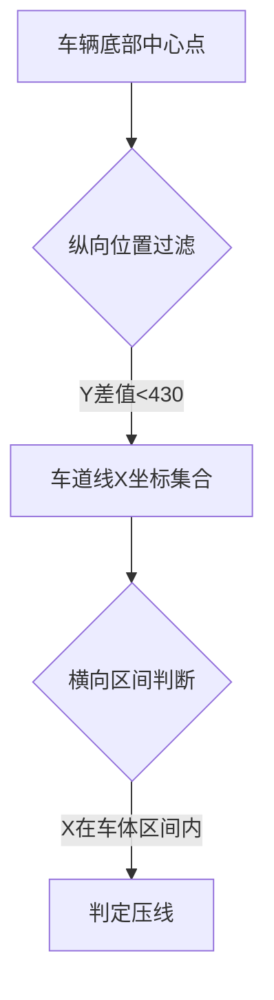

# 车压线检测系统开发文档

## 目录
1. 项目概述
2. 环境依赖
3. 项目结构
4. 模块说明
5. 算法原理
6. 使用方法


---

## 1. 项目概述
本项目为基于计算机视觉的车道压线检测系统，主要实现以下功能：
• 实时车道线检测（使用UFLD模型）
• 车辆检测（使用YOLOv8模型）
• 压线行为判定算法
• 车牌识别功能集成
• 鸟瞰图变换与可视化
• 违规车辆图像保存与记录

技术亮点：
• 双模型协同检测（车道线+车辆）
• 自适应鸟瞰图变换
• 基于ORB特征匹配的图像配准
• 多线程车牌识别

---

## 2. 环境依赖
推荐使用文件中的company.yaml文件，安装相关依赖。
推荐使用CUDA 11.8环境加速计算

---

## 3. 项目结构
```
Ultra_Fast_Lane_Detection
├── checkpoints/
│   └── tusimple_18.pth          # UFLD预训练模型
├── data/
│   └── constant.py              # 车道线锚点定义
├── detect_plate.py              # 车牌识别子模块
├── model/
│   └── model.py                 # UFLD网络定义
├── image/                       # 输出图像存储目录
├── yolov8n.pt                   # YOLOv8检测模型
└── Vehicle-lane-detection.py    # 主程序
Chinese_license_plate_detection_recognition
main.py
company.yml
```

---

## 4. 模块说明

### 4.1 核心模块
1. **车道线检测 (detect_lanes)**
   • 输入：视频帧
   • 输出：车道线坐标列表
   • 使用UFLD模型进行车道线定位
   • 基于Softmax的概率分布预测

2. **车辆检测 (detect_vehicles)**
   • 输入：视频帧
   • 输出：车辆边界框(NMS处理后)
   • 使用YOLOv8n进行实时检测
   • 集成NMS非极大值抑制

3. **压线判定 (is_vehicle_crossing)**
   • 判断逻辑：车辆底部中心点投影检测
   • 容差范围：±430像素纵向区域
   • 多车道线交叉检测

4. **鸟瞰图变换 (bird_view_transform)**
   • 基于ORB特征匹配的自适应仿射变换
   • 支持动态参考帧更新
   • 双线性插值保真处理

---

## 5. 算法原理

### 5.1 模型架构
| 模型        | 输入尺寸   | 输出维度      | 推理速度 (CPU) |
|------------|-----------|-------------|---------------|
| UFLD       | 288×800   | 57×4×2      | 120ms/frame   |
| YOLOv8n    | 640×640   | 6×n         | 45ms/frame    |

### 5.2 压线检测逻辑


### 5.3 鸟瞰图变换流程
1. ORB特征检测 (n=1000)
2. BruteForce-Hamming匹配
3. RANSAC仿射矩阵估计
4. 双线性插值变换

---

## 6. 使用方法

### 6.1 如何执行

使用main.py文件即可运行，需要安装相关依赖，使用company.yml文件进行环境配置。

### 6.2 注意事项

由于github单文件限制不能超过100MB，你可以在以下网址下载到UFLD的预训练权重文件[tusimple_18.pth - Google Drive](https://drive.google.com/file/d/1WCYyur5ZaWczH15ecmeDowrW30xcLrCn/view)
注意将其放在checkpoint文件夹下。否则无法运行。

### 6.3 输出说明
| 文件类型          | 保存路径      | 内容描述               |
|------------------|-------------|----------------------|
| 原始帧           | image/*_original.jpg | 违规时刻原始图像     |
| 车牌识别结果      | 控制台输出      | 识别出的车牌号码     |

---

## 7. 示例输出

### 控制台输出：
```
🚗 车辆压线: 车中心 (652, 720), 车道线 x: [645, 653]
保存压线帧：../车压线视频/test.mp4
车牌识别结果: 浙A12345
```