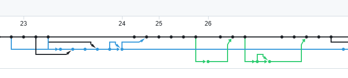

# 基于 RAG 的智能问答系统

- 陆昊宇：功能实现、平台搭建；
- 董文杰：报告撰写、PPT 制作；
- 项目源码：[https://github.com/Mr-LUHAOYU/HeartDance/tree/main/Project1-LLM](https://github.com/Mr-LUHAOYU/HeartDance/tree/main/Project1-LLM)

---

## 主要特性

- 支持图像和markdown文件的批量处理
- 生成带有适当错误处理的Python函数
- 将函数转换为JSON工具描述，便于集成
- 提供批量操作的进度跟踪
- 包含Gradio界面，支持交互式使用
- 集成简易的问答系统
- 提供模型参数的调整
- 支持批量文件的导入
- 支持文件信息的预览
- 支持批量文件的删除

## 成果展示

## 上传页

## 多文件上传过程

## 知识库

此处上传图片后，这里的数据可能没有及时更新，点击刷新按钮即可。

## 刷新后

## 代码预览

## markdown预览

## json预览

## 批量文件删除

## 智能问答系统

## 历史问答

## 参数设置

## 保存参数

## 恳请老师批评指正
