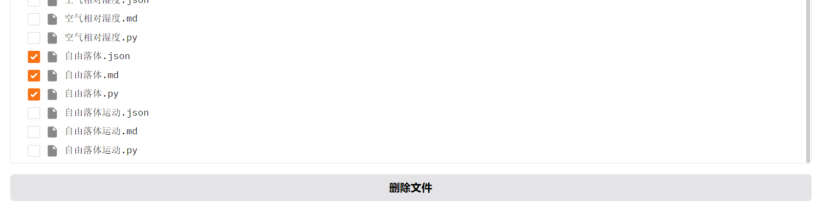

# LLM

访问 [https://github.com/Mr-LUHAOYU/HeartDance](https://github.com/Mr-LUHAOYU/HeartDance) 获取最新代码

## 流程组件

1. **formula_from_images_dir.py**
   - 使用OCR（光学字符识别）从图像中提取公式
   - 利用 `['qwen-vl-plus', 'qwen-vl-max', 'qvq-72b-preview']` 模型进行图像处理
   - 支持处理单个图像或整个目录
   - 以markdown格式输出提取的公式

2. **code_from_formulas_dir.py**
   - 根据公式描述生成Python函数
   - 使用 `['qwen-plus', 'qwq-32b', 'qwq-plus']` 模型进行代码生成
   - 处理包含公式描述的markdown文件
   - 输出带有适当错误处理和参数检查的Python函数

3. **json_from_codes_dir.py**
   - 将Python函数转换为JSON工具描述
   - 生成包含参数详细信息的函数JSON表示
   - 处理目录中的Python文件
   - 在指定的知识库目录中输出JSON文件

4. **inject2db.py**
   - 将知识库中的Markdown文件内容转换为嵌入向量
   - 使用sentence-transformers模型生成文本嵌入
   - 将嵌入向量存储到SQLite数据库中
   - 支持清空现有数据并重新填充数据库
   - 提供进度跟踪和完成确认

5. **search.py**
   - 实现基于向量相似度的文档搜索功能
   - 使用SQLite数据库存储和检索文档嵌入向量
   - 支持指定搜索查询和返回结果数量
   - 计算查询与数据库中文档的余弦相似度
   - 返回最相关的文档文件名及其相似度得分


6. **funcation_call.py**
   - 提供函数装饰和执行的实用工具
   - 包括转换字符串参数、执行代码和格式化结果的方法
   - 支持在markdown输出中渲染LaTeX公式
7. **unified_pipeline.py**
   - 流程处理管道类
   - 接收所有传入的图片，并将其置于Temp目录下
   - 依次调用formula_from_images_dir、code_from_formulas_dir、json_from_codes_dir、inject2db逻辑
   - 将产生的结果置于数据库目录，清空临时目录
8. **cilents.py**
   - 提供预定义的大语言模型
9. **file2cloud.py**
   - 提供图片、文本等文件在云端的上传下载接口
   - 文件将会上传到阿里云OSS对象服务
10. **file_upload.py**
    - 上传页的页面设计与回调函数
    - 支持上传单文件、多文件以及目录下所有文件
    - 当含有公式的图片上传时，会通过上面的步骤处理图片
    - 处理进度采用流式输出展示
11. **knowledge_sys.py**
    - 知识库展示页的设计
    - 可以预览某个文件信息
    - 可以选择多个文件一起删除
    - 支持Markdown中的Latex渲染
    - 支持Json文件的渲染展示
    - 支持python代码的渲染展示
12. **Q8A.py**
    - 问答系统的展示页设计
    - 一个简单的交互系统，可以看到历史对话信息
    - 支持markdown中的Latex渲染
13. **settings.py**
    - 模型配置页的设计
    - 可以选择不同的ocr和coder模型，并调整temperature参数
14. **app.py**
    - 启动器脚本

## 设置和使用

1. 安装依赖项：
   ```
   gradio
   openai
   json_repair
   oss2
   ```

2. 运行app.py脚本

## 主要特性

- 支持图像和markdown文件的批量处理
- 生成带有适当错误处理的Python函数
- 将函数转换为JSON工具描述，便于集成
- 提供批量操作的进度跟踪
- 包含Gradio界面，支持交互式使用
- 集成简易的问答系统
- 提供模型参数的调整
- 支持批量文件的导入
- 支持文件信息的预览
- 支持批量文件的删除

## 成果展示

### 上传页


### 多文件上传过程


### 知识库


此处上传图片后，这里的数据可能没有及时更新，点击刷新按钮即可。

### 刷新后


### 代码预览


### markdown预览


### json预览


### 批量文件删除



### 智能问答系统


### 历史问答


### 参数设置


### 保存参数


