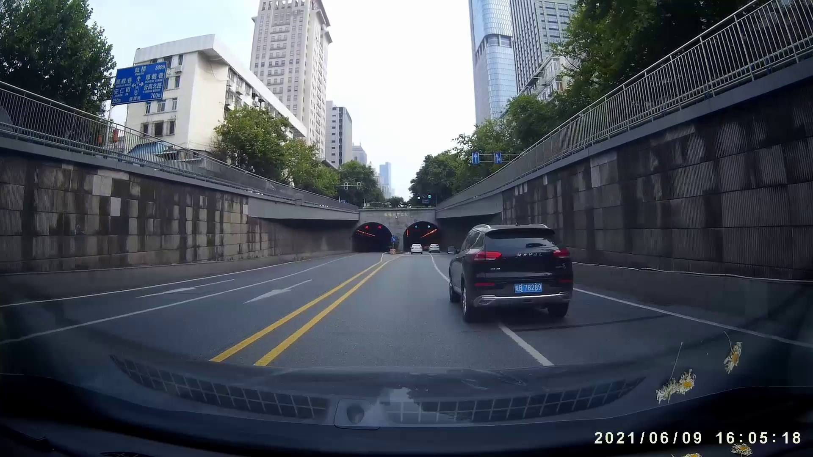
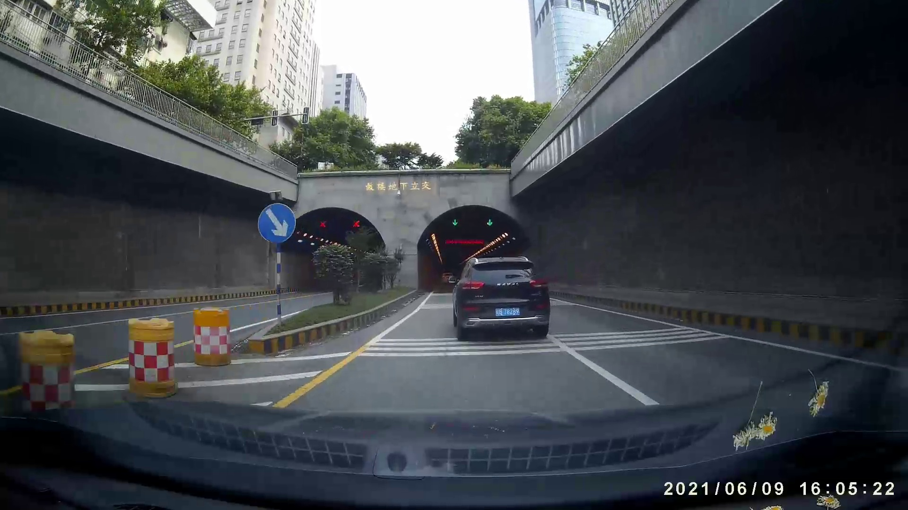

# 基于 YOLOv8 的车压线检测系统

- 符皓宇：算法实现；
- 董文杰：功能完善、模型部署、报告撰写、PPT 制作；
- 项目源码：[https://github.com/Mr-LUHAOYU/HeartDance/tree/main/Project2-LaneDetect](https://github.com/Mr-LUHAOYU/HeartDance/tree/main/Project2-LaneDetect)

## 成果展示

经过优化与测试，我们的模型仅占用约 0.5GB 的内存，部署在 4GB 的 nano 开发板上运行良好。下面开始展示具体成果。

## 程序启动

## 程序运行中

## 抽帧：压线中

## 抽帧：压线后

## 算法简介

1. 车体识别使用成熟的方法：YOLOv8  
2. 车线检测及压线判断的策略：考虑到单独检测的车线和车体的空间关系难以描述，并且只能用数字图像处理的方式判断是否压线，于是尝试数字图像处理直接检测车线，检测方式更加统一，有利于对压线状态的判断。  

## 算法流程

1. **将图像转换为鸟瞰图**：利于对空间距离和关系的判断；  
2. **车道线检测**：使用已有的成熟方法, Canny 边缘检测和霍夫变换车道线检测；  
3. 合并方向相同且相近的车线（图像检测的），模拟现实逻辑的单车线（实际视觉的）；  
4. **判断车辆是否压线**：只有相互接近的多个车道线（因为无法完全得到实际对应的单车线）都通过车辆底部的横向中段 1/3 才算压线（模拟车体过线）；  
5. 有判断为压线的连续帧，只取过程的 **正中间帧，最后一帧**。

## 恳请老师批评指正
