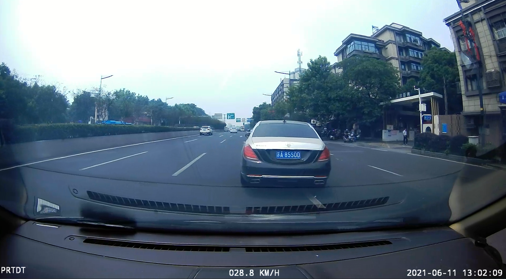

# 基于 ULFLD 的车压线检测系统

- 李世博：算法实现、报告撰写；
- 董文杰：PPT 制作；
- 项目源码：[https://github.com/Mr-LUHAOYU/HeartDance/tree/main/Project2-LaneDetect-UFLD](https://github.com/Mr-LUHAOYU/HeartDance/tree/main/Project2-LaneDetect-UFLD)

## 抽帧：压线中



## 抽帧：压线中


## 项目概述

本项目为基于计算机视觉的车道压线检测系统，主要实现以下功能：

- 实时车道线检测（使用UFLD模型）
- 车辆检测（使用YOLOv8模型）
- 压线行为判定算法
- 车牌识别功能集成
- 鸟瞰图变换与可视化
- 违规车辆图像保存与记录

---

技术亮点：

- 双模型协同检测（车道线+车辆）
- 自适应鸟瞰图变换
- 基于ORB特征匹配的图像配准
- 多线程车牌识别

## 项目结构

```
Ultra_Fast_Lane_Detection
├── checkpoints/
│   └── tusimple_18.pth          # UFLD预训练模型
├── data/
│   └── constant.py              # 车道线锚点定义
├── detect_plate.py              # 车牌识别子模块
├── model/
│   └── model.py                 # UFLD网络定义
├── image/                       # 输出图像存储目录
├── yolov8n.pt                   # YOLOv8检测模型
└── Vehicle-lane-detection.py    # 主程序
Chinese_license_plate_detection_recognition
main.py
company.yml
```

## 模块说明

1. **车道线检测 (detect_lanes)**
   - 输入：视频帧
   - 输出：车道线坐标列表
   - 使用UFLD模型进行车道线定位
   - 基于Softmax的概率分布预测

2. **车辆检测 (detect_vehicles)**
   - 输入：视频帧
   - 输出：车辆边界框(NMS处理后)
   - 使用YOLOv8n进行实时检测
   - 集成NMS非极大值抑制

---

3. **鸟瞰图变换 (bird_view_transform)**
   - 基于ORB特征匹配的自适应仿射变换
   - 支持动态参考帧更新
   - 双线性插值保真处理

4. **压线判定 (is_vehicle_crossing)**
   - 判断逻辑：车辆底部中心点投影检测
   - 容差范围：±430像素纵向区域
   - 多车道线交叉检测

## 算法原理

模型架构：

| 模型        | 输入尺寸   | 输出维度      | 推理速度 (CPU) |
|------------|-----------|-------------|---------------|
| UFLD       | 288×800   | 57×4×2      | 120ms/frame   |
| YOLOv8n    | 640×640   | 6×n         | 45ms/frame    |

鸟瞰图变换流程：

1. ORB特征检测 (n=1000)
2. BruteForce-Hamming匹配
3. RANSAC仿射矩阵估计
4. 双线性插值变换

## 恳请老师批评指正
