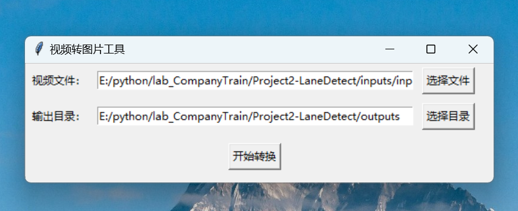
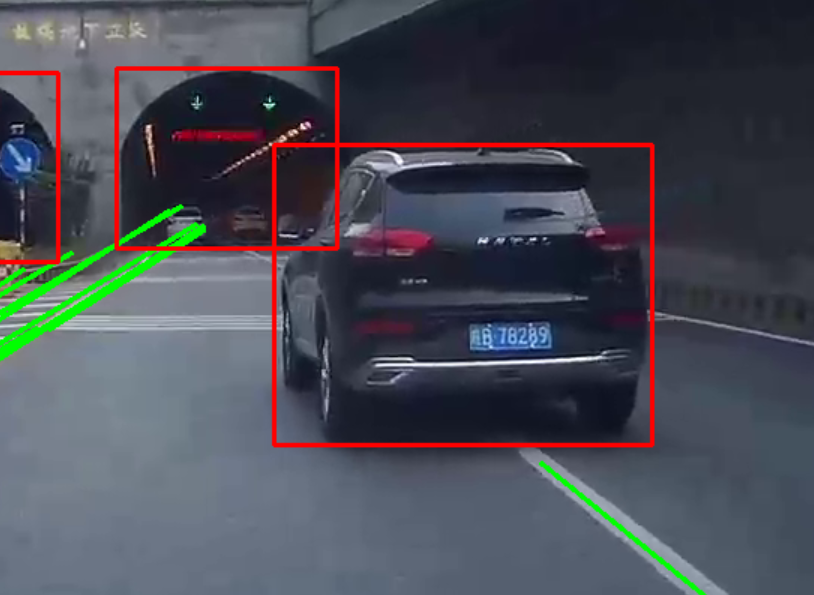
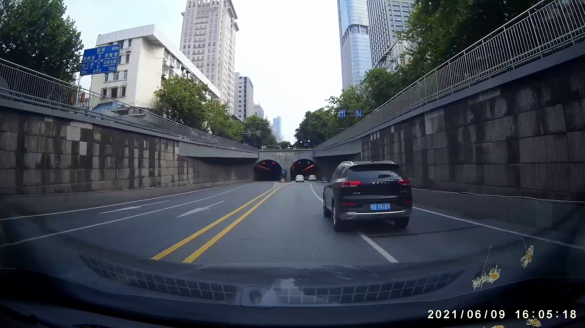
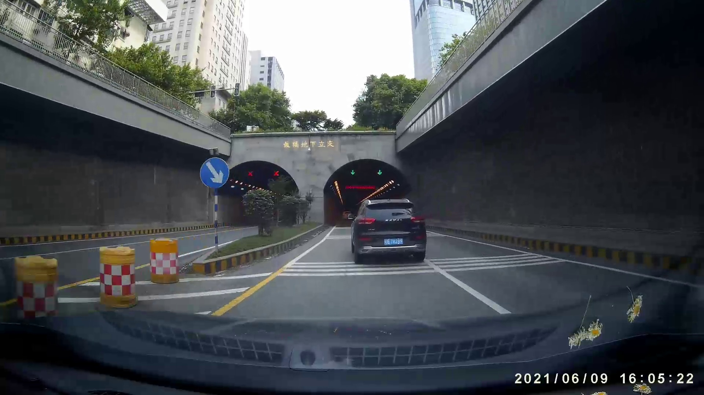

# 项目二 车压线检测

## 成果展示

## 项目背景

传统车压线检测依赖人工监控，耗费大量人力和时间成本，且易受主观因素影响。为提高检测效率与准确性，本项目提出两种智能解决方案：一是基于YOLOv8的目标检测与数字图像处理方法，实时识别车辆与车道线位置；二是采用超快速结构感知的深度检测方法，通过深度学习模型直接预测车辆与车道线的空间关系。两种方法均可实现自动化、高精度检测，显著降低人工干预成本，适用于交通管理与智能驾驶场景。

## 算法简介

### 基于 YOLOv8 与的数字图像处理方法

FHY TODO

### 基于超快速结构感知的深度检测方法

LSB TODO

## 边缘部署

经过优化与测试，我们的模型仅占用约 0.5GB 的内存，部署在 4GB 的 nano 开发板上绰绰有余。
