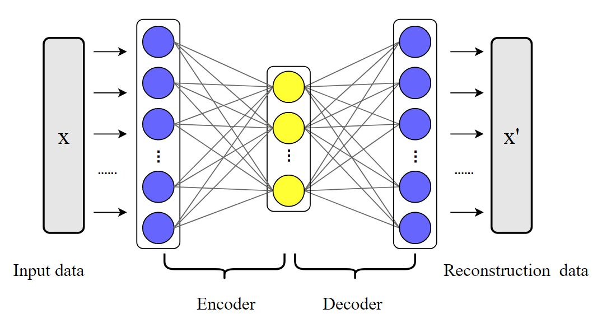
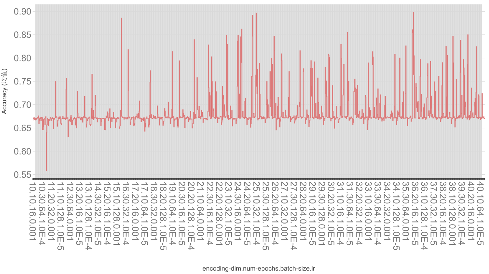
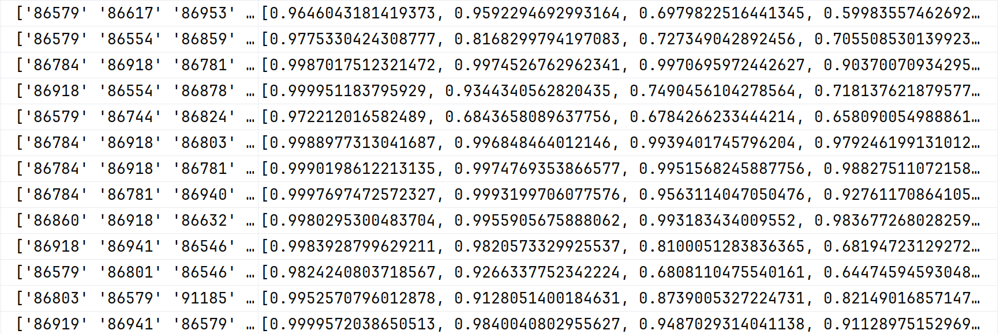

# 基于自编码器的地铁制动缸泄漏异常检测定位系统

- 陆昊宇：算法实现、报告撰写；
- 董文杰：PPT 制作；
- 项目源码：[https://github.com/Mr-LUHAOYU/HeartDance/tree/main/Project3-AnomalyDetection](https://github.com/Mr-LUHAOYU/HeartDance/tree/main/Project3-AnomalyDetection)

## 实验目标

本实验旨在开发一个基于深度学习的异常检测系统，用于：

1. 根据地铁制动缸100多个传感器的检测值判断是否存在异常
2. 准确定位异常传感器
3. 为维护人员提供可解释的异常特征排名

## 模型架构



---

**编码器(Encoder)**:

1. LayerNorm层（输入维度）
2. 线性层（input_dim → encoding_dim）
3. LayerNorm层（encoding_dim）
4. ReLU激活函数

**解码器(Decoder)**:
1. LayerNorm层（encoding_dim）
2. 线性层（encoding_dim → input_dim）
3. LayerNorm层（input_dim）
4. Sigmoid激活函数

## 训练配置

- 设备：自动选择CUDA(GPU)或CPU
- 默认超参数：
  - encoding_dim: 36
  - num_epochs: 30
  - batch_size: 16
  - learning_rate: 1e-3
- 损失函数：均方误差损失(MSELoss)
- 优化器：Adam

## 超参数搜索

通过`search_best_param()`函数进行网格搜索，评估不同超参数组合的性能：
- encoding_dim范围：10-40
- batch_size选项：16, 32, 64, 128
- learning_rate选项：1e-3, 1e-4, 1e-5
- epoch选项：10, 20, 30, 40, 50

得到的最佳的性能组合为：

```json
{
    "encoding_dim": 36,
    "num_epochs": 30,
    "batch_size": 16,
    "learning_rate": 1e-3
}
```

## 实验结果

该组合的性能为90%：
详细的指标结果可以参考 [result.csv](https://github.com/Mr-LUHAOYU/HeartDance/blob/main/Project3-AnomalyDetection/result.csv)

### 3.2 异常特征定位

推断出的异常特征案例：



## 结论

本实验成功实现了一个基于自编码器的地铁制动缸泄漏异常检测系统，能够有效识别异常并定位异常传感器。通过超参数搜索可以进一步优化模型性能，为地铁制动系统的预防性维护提供了有力工具。

## 恳请老师批评指正
