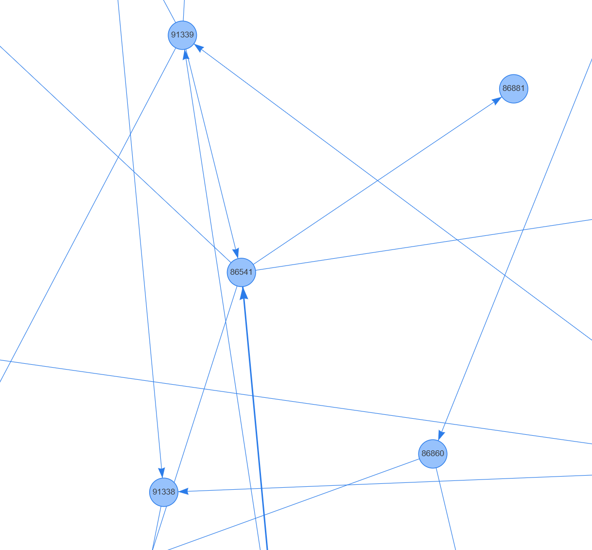
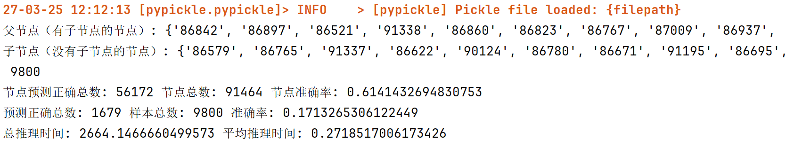
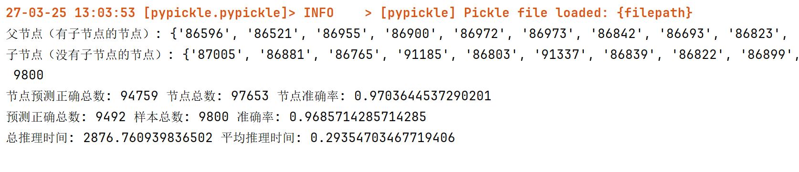

# 基于贝叶斯网络的地铁制动缸泄漏异常检测定位系统

- 董文杰、陆昊宇：算法实现、报告撰写、PPT 制作；
- 项目源码：[https://github.com/Mr-LUHAOYU/HeartDance/tree/main/Project3-AnomalyDetection](https://github.com/Mr-LUHAOYU/HeartDance/tree/main/Project3-AnomalyDetection)

## 实验目标

本实验旨在开发一个基于贝叶斯网络的异常检测系统，用于：

1. 根据地铁制动缸 100 多个传感器的检测值判断是否存在异常；
2. 准确定位异常传感器；
3. 为维护人员提供可解释的异常特征排名。

## 实验结果

部分网络结构示意图如左图所示。模型在测试集上的平均预测准确率为 **90.2%**，特异性为 83%，敏感性为 97%。泛化性能良好。

---

**特异性**。对于异常数据点，预测的正确率为 **83%**，下图展示的准确率是指判断为正常样本的频率。

**敏感性**。对于正常数据点，预测的准确率为 **97%**，下图展示的准确率是指判断为正常样本的频率。

## 算法简介

贝叶斯网络 (Bayesian Network) 是一种概率图模型，由 **有向无环图(DAG)** 和 **条件概率表(CPT)** 组成。在地铁制动缸泄漏检测系统中，网络架构包含三个核心组件：

1. **结构学习** - 确定变量间的依赖关系；
2. **参数学习** - 计算各节点的条件概率分布；
3. **信息推断** - 基于观测数据进行概率推理。

关于信息推理：

1. **输入证据**：将父节点的传感器值作为证据输入模型。
2. **推理预测**：对每个子节点的状态进行推理，判断其是否处于异常状态。
3. **结果评估**：若子节点的预测状态与实际状态一致（且概率高于阈值），则视为正确预测。统计正确预测的节点数量和样本数量，计算准确率。

## 关于部署

模型在每一个测试样本上的推理速度大约为 0.3 秒。在性能不高的板卡等设备边缘部署时，推理时间将会进一步加大。如果需要进行实时监测，可能需要较好的边缘算力支撑，或者对预测算法进行优化。

## 结论

本实验基于贝叶斯网络构建的地铁制动缸泄漏异常检测定位系统，能够有效检测异常并定位到具体传感器节点。实验结果表明，模型在准确率和推理效率上均表现良好，具备实际应用潜力。未来可通过进一步优化模型和扩展数据集，提升系统性能。

## 恳请老师批评指正
