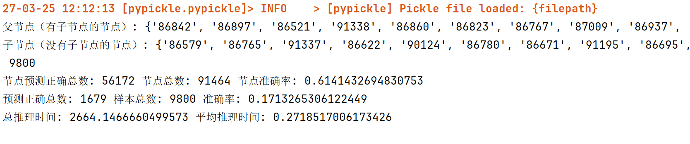
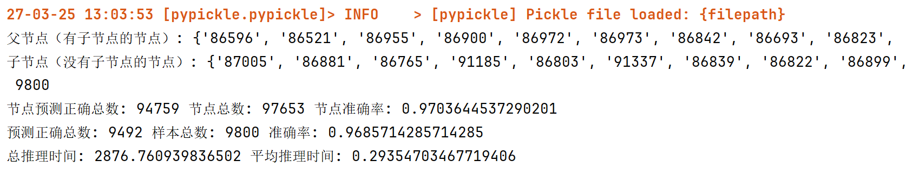

# 地铁制动缸泄漏异常检测定位系统

## 1. 实验目标

本实验旨在开发一个基于深度学习的异常检测系统，用于：

1. 根据地铁制动缸100多个传感器的检测值判断是否存在异常
2. 准确定位异常传感器
3. 为维护人员提供可解释的异常特征排名

## 2. 实验方法

### 2.1 数据准备

- 训练数据：`data_origin.csv`（正常工况数据）
- 测试数据：
  - `metrics_abnormal.csv`（异常数据，标签为1）
  - `metrics_anomaly.csv`（正常数据，标签为0）
- 数据预处理：
  - 使用MinMaxScaler进行归一化
  - 合并测试数据并生成对应标签

### 2.2 模型架构

### 贝叶斯网络

贝叶斯网络(Bayesian Network)是一种概率图模型，由**有向无环图(DAG)**和**条件概率表(CPT)**组成。在地铁制动缸泄漏检测系统中，网络架构包含三个核心组件：

1. **结构学习** - 确定变量间的依赖关系
2. **参数学习** - 计算各节点的条件概率分布
3. **信息推断** - 基于观测数据进行概率推理

### 异常检测与定位

1. **输入证据**：将父节点的传感器值作为证据输入模型。
2. **推理预测**：对每个子节点的状态进行推理，判断其是否处于异常状态。
3. **结果评估**：
   - 若子节点的预测状态与实际状态一致（且概率高于阈值），则视为正确预测。
   - 统计正确预测的节点数量和样本数量，计算准确率。

### 2.3 评价指标

模型采用准确率Accuracy作为评价指标。

## 3. 实验结果

模型学习到的结构特征：

  
点击展开/折叠结构特征图形

  <iframe src="img-src/interactive_bn.html" width="150%" height="900"></iframe>

对于异常数据点，预测的正确率为：83%，下图展示的准确率是指判断为正常样本的频率。

对于正常数据点，预测的准确率为：97%，下图展示的准确率是指判断为正常样本的频率。

模型对于每个输入的平均推理时间大约是0.3秒。

在性能不高的板卡等设备边缘部署时，推理时间将会进一步加大。

如果需要进行实时监测，可能需要较好的算力支撑，或者对预测算法进行优化。

## 4. 使用说明

1. **环境要求**：

   - Python 3.x
   - pandas
   - numpy
   - scikit-learn
   - bnlearn

2. **运行方式**：

   - 修改您的模型路径及需要测试的数据，然后运行``bayes.py``脚本。

   - 如果您没有训练相关的模型，并希望直接进行测试，可以从这里[下载](https://website-lhy.oss-cn-shanghai.aliyuncs.com/bnlearn_model.pkl)我们的模型参数。

3. **其它说明**：

   - 本项目可以用于实时检测系统是否异常，并报告异常链。

## 5. 改进方向

- 尝试优化贝叶斯网络结构或引入更多特征。
- 尝试模型简化或硬件加速。

## 6. 结论

本实验基于贝叶斯网络构建的地铁制动缸泄漏异常检测定位系统，能够有效检测异常并定位到具体传感器节点。实验结果表明，模型在准确率和推理效率上均表现良好，具备实际应用潜力。未来可通过进一步优化模型和扩展数据集，提升系统性能。

